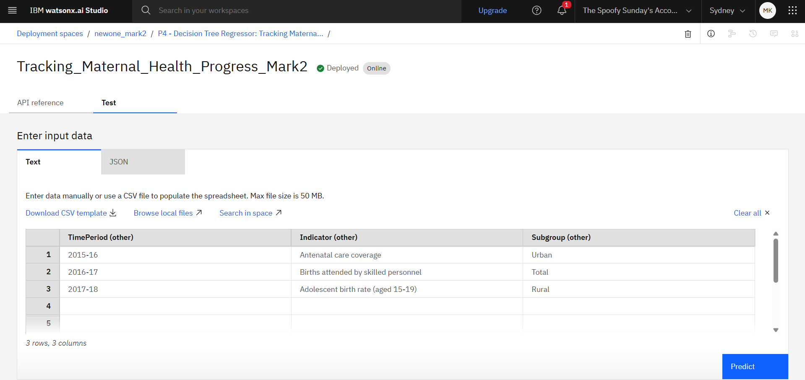
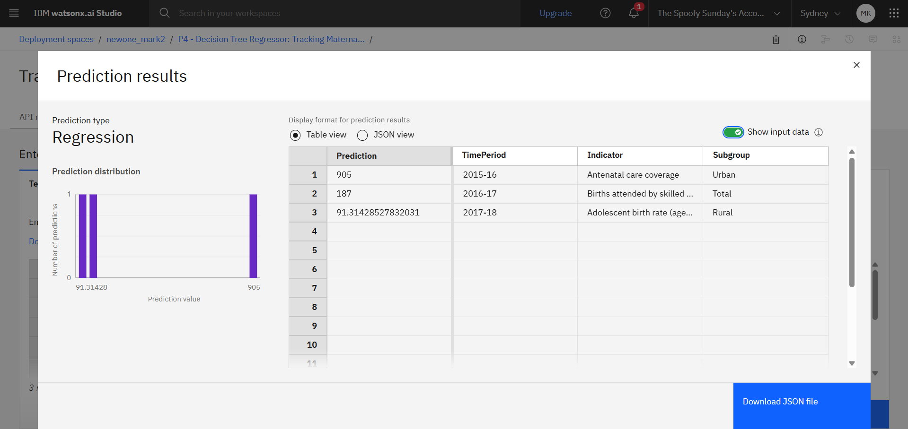

# IBM-SkillsBuild-Internship-on-AI-Cloud-Technologies-Project

# 📊 Tracking Maternal Health Progress using Machine Learning

This project aims to predict and analyze maternal health progress over time using machine learning. It focuses on key health indicators like Maternal Mortality Ratio (MMR), segmented by region and subgroup. The entire pipeline was implemented using Python and deployed on **IBM Cloud** via Watson Machine Learning.

This work was completed during my virtual internship under **Edunet Foundation**, supported by **IBM SkillsBuild** and **AICTE**.

---

## 🔧 Tools & Technologies

- **Languages:** Python  
- **Libraries:** Pandas, NumPy, Scikit-learn, Matplotlib, Seaborn  
- **Platform:** IBM Watson Studio, IBM Cloud  
- **Notebook Environment:** Jupyter (locally run)

---

## 📁 Project Structure

```
📦 Tracking_Maternal_Health_Progress
│
├── datafile.csv                  # Raw dataset
├── pivoted_file.csv             # Cleaned and pivoted dataset
├── Tracking Maternal Health Progress Notebook.ipynb   # IBM Cloud Notebook File
├── screenshots/                 # Screenshots of deployment and results
└── README.md                    # Project documentation
```

---

## ✅ Workflow

1. **Data Loading**: Used `datafile.csv` (raw format).
2. **Pivoting and Cleaning**: Converted to subgroup-wise time-series format (`pivoted_file.csv`).
3. **Exploratory Data Analysis (EDA)**: Insights on urban/rural trends, indicator values over time.
4. **Model Training**: Linear Regression on subgroup values (target: `DataValue`).
5. **Evaluation**: Visualized predictions vs. actuals, calculated MSE.
6. **Deployment**: Model deployed on IBM Watson Machine Learning.

---

## 🌐 IBM Cloud Deployment

The final model was successfully deployed using **IBM Watson Machine Learning_


## 📷 Screenshots

- 
- 

(Screenshots are located in the `screenshots/` folder.)

---

## 👤 Author

**Mohd Sheeban Khan**  
BCA | Invertis University  
Intern at Edunet Foundation via IBM SkillsBuild  
